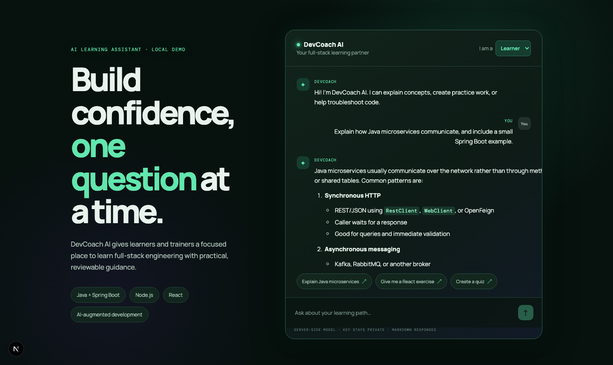

# DevCoach AI

DevCoach AI is a small, runnable AI learning assistant for software-development
learners and trainers. It uses a React frontend, a Spring Boot microservice, and
Spring AI for the optional external model path.



## Run it

```bash
cd ~/code/ai-learning-assistant
cp .env.example .env
npm install
npm run dev
```

In a second terminal, start the Spring Boot service:

```bash
cd ~/code/ai-learning-assistant/backend
mvn spring-boot:run
```

Open [http://localhost:3000](http://localhost:3000). Choose Learner or Trainer,
then use a suggested prompt or ask a question.

The default `CHAT_MODE=local` is deterministic and requires no token. To prepare
for a provider integration, `.env` contains:

```dotenv
MODEL=gpt-5.6-luna
MODEL_KEY=PASTE_YOUR_MODEL_KEY_HERE
CHAT_MODE=local
```

Put the literal model key in your local `.env`; `.env` is ignored by Git and the
key is read only by the Spring Boot service. It is never sent to the browser.
Set `CHAT_MODE=external` to make Spring AI call the configured model.

## What the demo does

- Learners get explanations, exercises, and troubleshooting prompts.
- Trainers get quiz and assignment-generation guidance.
- The Spring Boot API validates incoming JSON before business logic runs.
- Local mode is implemented in `ChatService` so it runs without a token.
- External mode uses Spring AI's `ChatClient` and OpenAI starter.

## Architecture

```text
React chat UI → Next.js same-origin proxy → Spring Boot /api/chat
                                           ├→ local response service
                                           └→ Spring AI ChatClient → model
```

The local response service is deliberately small and deterministic so it can be
tested without mocking an external service. In a production version, add
authentication, conversation persistence, retrieval over approved course
documents, moderation, observability, and a provider adapter behind the same
API boundary.

## Verify

```bash
npm run typecheck
npm test
npm run build
cd backend && mvn test
```

To exercise the API directly while the dev server is running:

```bash
curl -s -X POST http://localhost:3000/api/chat \
  -H 'content-type: application/json' \
  -d '{"message":"Explain Java microservices","role":"learner"}'
```

The full scope and acceptance criteria are in
[`specs/001-learning-assistant-demo.md`](specs/001-learning-assistant-demo.md).
